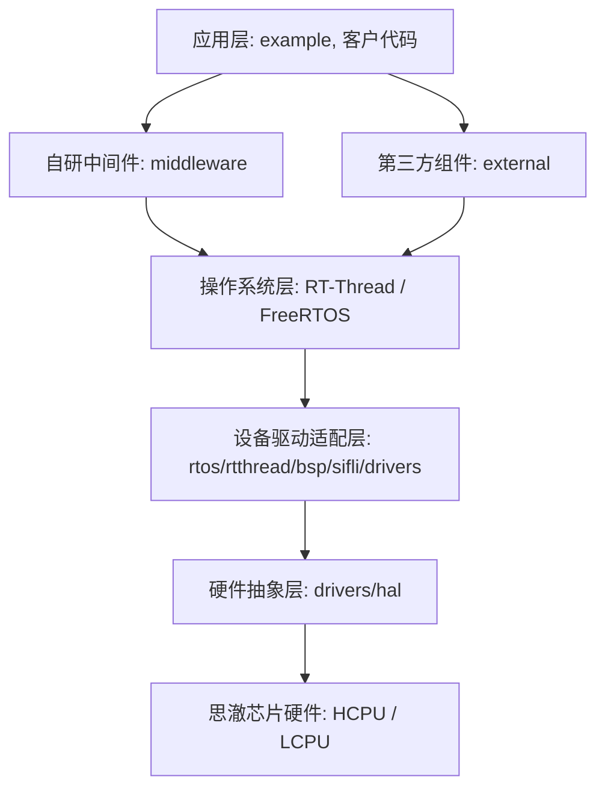

# SiFli-SDK 项目架构与技术深度分析报告

## 1. 项目定位与概述
SiFli-SDK 是思澈科技（SiFli）官方为其系列芯片（SF32LB52x/55x/56x/58x）提供的软件开发套件（SDK）。该 SDK 以实时操作系统 **RT-Thread** 为核心（同时也集成了 FreeRTOS 并提供 OS 适配层），构建了一套高度模块化、面向智能穿戴（智能手表/手环）与物联网（IoT）应用的软件框架。

---

## 2. 软件架构分层解析
SiFli-SDK 的整体架构分为以下几个层次：

### 2.1 硬件抽象层 (HAL & LL)
- **目录路径**：[drivers/hal](file:///f:/work/gitcode/SiFli-SDK/drivers/hal) 和 [drivers/Include](file:///f:/work/gitcode/SiFli-SDK/drivers/Include)
- **主要内容**：包含芯片寄存器映射、启动文件、底层时钟复位控制（RCC）以及各外设的底层驱动实现（如 `bf0_hal_uart.c`、`bf0_hal_gpio.c` 等）。
- **技术亮点**：
  - **EPIC (EZ-PHY Image Coprocessor)**：思澈独有的 2D 图形加速硬件驱动（`bf0_hal_epic.c`），支持 2D 图形混合、旋转、缩放与颜色转换，是穿戴式高帧率 UI 的核心硬件基础。
  - **EZIP**：硬件图像解压引擎（`bf0_hal_ezip.c`），支持高效的图片压缩与实时解压，极大降低了 Flash 存储与运行内存的占用。
  - **MPI/PSRAM**：大容量外部 RAM 与 Flash 的映射与控制驱动（`bf0_hal_mpi_psram.c`）。

### 2.2 操作系统层与适配层 (RTOS & OS Adaptor)
- **目录路径**：[rtos/rtthread](file:///f:/work/gitcode/SiFli-SDK/rtos/rtthread) 和 [rtos/freertos](file:///f:/work/gitcode/SiFli-SDK/rtos/freertos)
- **核心组件**：
  - **RT-Thread**：为主流的 OS 选择，提供完整的设备驱动模型和 Shell 工具（finsh）。
  - **OS Adaptor (os_adaptor)**：提供统一的 OS 抽象层 API。无论底层运行的是 RT-Thread、FreeRTOS 还是 PC 模拟器环境，上层应用和中间件都可以使用相同的同步、通信与互斥接口。

### 2.3 BSP 设备驱动层
- **目录路径**：[rtos/rtthread/bsp/sifli/drivers](file:///f:/work/gitcode/SiFli-SDK/rtos/rtthread/bsp/sifli/drivers)
- **工作机制**：实现 RT-Thread 标准设备模型与思澈底层 HAL 的桥接。通过统一的 I/O 设备管理接口（如 `rt_device_find`、`rt_device_open`、`rt_device_write` 等）对外提供服务。
- **代表性驱动**：
  - `drv_lcd.c` / `drv_lcd_fb.c`：液晶显示屏与帧缓冲区（FrameBuffer）驱动。
  - `drv_epic.c` / `drv_epic_mask.c`：与图形库结合的 EPIC 硬件加速驱动。
  - `drv_touch.c`：电容式触摸屏驱动。
  - `drv_bt.c`：蓝牙控制器与主机接口（HCI）的底层驱动。

### 2.4 思澈自研中间件 (Middleware)
- **目录路径**：[middleware](file:///f:/work/gitcode/SiFli-SDK/middleware)
- **核心模块**：
  - **异构双核控制 (acpu_ctrl)**：控制应用核（HCPU）与协议核（LCPU）的启动、挂起与电源状态。
  - **核间通信 (ipc_queue & ipc_queue_device)**：基于 Mailbox 硬件中断与共享内存的高效核间数据队列，支持 HCPU 与 LCPU 之间的大数据搬运。
  - **DFU 固件升级**：提供全面的 OTA 与本地固件升级功能（`dfu`、`dfu_pan`、`dfu_uart`）。
  - **应用框架与文件日志**：包括事件分发机制（`app_fwk`）与异常奔溃保存机制（`coredump`、`file_logger`）。

### 2.5 第三方与外部组件 (External)
- **目录路径**：`external/`（如 LVGL、CherryUSB、FlashDB 等）
- **核心组件集成**：
  - **LVGL V8 & V9**：深度集成开源图形库，并通过底层 `drv_vglite.c` 与 `drv_epic.c` 硬件加速接口进行高度适配，实现极其流畅的智能手表滑动与动画特效。
  - **CherryUSB**：高性能的 USB 主/从协议栈（集成了 CDC-ACM, MSC, HID, Audio 等常用类模板）。
  - **FlashDB**：非易失性键值存储与时序数据库，用于保存手表设置、健康测量历史数据等。
  - **FatFS**：兼容的文件系统，常用于 SD 卡或板载 EMMC。

---

## 3. 支持的核心芯片平台
SDK 通过同一套代码基座，通过 Kconfig 和编译宏支持了多种不同规格的 SoC：

| 芯片系列 | 核心架构特性 | 典型应用领域 |
| :--- | :--- | :--- |
| **SF32LB52X** | 单核/双核 Cortex-M33，集成低功耗 BLE，高性价比图形加速器 | 高性价比智能手表、手环、IoT 控制面板 |
| **SF32LB55X** | 双核 Cortex-M33 (HCPU + LCPU)，早期主推双核架构 | 经典智能手表、中端智能穿戴 |
| **SF32LB56X** | 增强型双核 Cortex-M33，主频更高，外设更丰富 | 中高端智能手表、运动手表 |
| **SF32LB58X** | 高性能双核 Cortex-M33，集成更强大的 GPU、支持 MIPI DSI / DPI 接口 | 高端 3D/2.5D 智能手表、智能屏显终端 |
| **SIMULATOR** | 支持直接将 SDK 业务与 GUI 逻辑编译为 PC executable 运行调试 | 离线 UI 快速迭代与业务模拟开发 |

---

## 4. 核心技术优势分析

### 4.1 异构多核协同（HCPU + LCPU）
- **职责划分**：主核（HCPU）运行复杂的 GUI (LVGL)、多媒体解码和上层业务逻辑；从核（LCPU）运行超低功耗的蓝牙协议栈（Controller/Host）与基础传感器采集，确保系统在大部分息屏待机状态下，HCPU 可以完全关闭以节省电能。
- **核间通信**：通过硬件 Mailbox 触发核间中断，数据载荷通过共享 RAM 的双向 IPC Queue 传递，实测通信延迟低，数据吞吐量大。

### 4.2 极致的图形加速方案
- **硬件加持**：EPIC 图形加速器提供 Alpha 混合、图层叠加、色彩格式转换、旋转和多边形填充，结合 EZIP 压缩算法（将 PNG、JPG 转换为压缩的 ezip，并在刷屏时实时硬件解压到显示缓冲区），解决了嵌入式设备 Flash 带宽窄和 SRAM 容量受限的痛点。

### 4.3 精细化的电源管理系统（PM Framework）
- **多电源域控制**：SDK 能够对芯片内部的 HPAON（应用常开域）、LPAON（低功耗常开域）、LCPU 域、HCPU 域进行独立管理。
- **自动睡眠唤醒**：在 RT-Thread 的 Idle 线程中集成 PM 框架，若没有任务执行，自动降低系统主频、关闭未使用外设或进入 Deep Sleep，等待蓝牙事件、RTC 或 GPIO 唤醒。

---

## 5. 构建系统与工具链生态
- **编译机制**：采用 **SCons** 工具结合 **Kconfig**。开发者可以通过类似于 Linux 的 `menuconfig` 工具，可视化地配置各外设驱动、中间件以及第三方组件的开启与参数。
- **工程结构**：
  - 各应用例程位于 `example/` 路径中（如 `example/get-started/hello_world/rtt`）。
  - 切换至具体的工程 `project` 目录，通过 `scons --board=<board_name>` 进行命令行编译，支持自动化并行构建。
- **工具链集成**：`tools/` 目录下集成了非常丰富的辅助开发工具：
  - **AStyle.exe**：代码格式化工具。
  - **SiFli_RfTool**：射频性能调试工具。
  - **BurnDriverEx / uart_download**：固件烧录与下载工具。
  - **crash_dump_analyser**：异常死机 dump 分析工具。
  - **png2ezip**：图片资源转硬件加速压缩格式工具。
